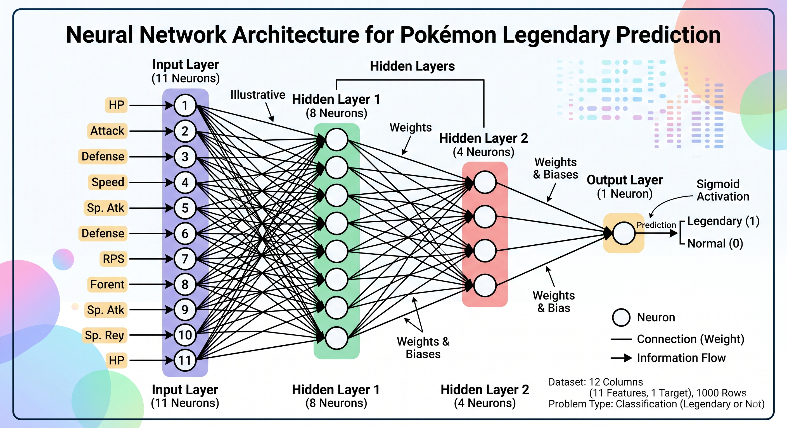

# Assignment: My First Neural Network

  
   
  <em>Figure 1: Neural Network Architecture for Pokemon Legendary Prediction</em>

### **Questions & Answers**

Based on the dataset containing 12 columns (11 features + 1 target) and 1000 rows, where the target is whether the Pokemon is legendary (1) or not (0), here are the answers:

**1. What type of problem is this?**
* **Answer:** **Binary-class classification**.
* **Reason:** The target variable has exactly two possible outcomes: either the Pokemon is legendary (represented by 1) or it is not (represented by 0). You are classifying data into one of two distinct categories.

**2. How many neurons should be there in the 1st layer?**
* **Answer:** **11 neurons**.
* **Reason:** The first layer (the Input Layer) must have one neuron for every input feature in your dataset. Since the dataset has 12 total columns and 1 of them is the target, you are left with 11 independent features (12 - 1 = 11) to feed into the network. 

**3. How many neurons should be there in the last layer?**
* **Answer:** **1 neuron**.
* **Reason:** The last layer (the Output Layer) provides the final prediction. In binary classification, standard practice is to use a single neuron with a Sigmoid activation function. This neuron will output a single value between 0 and 1, representing the probability that the Pokemon is legendary.